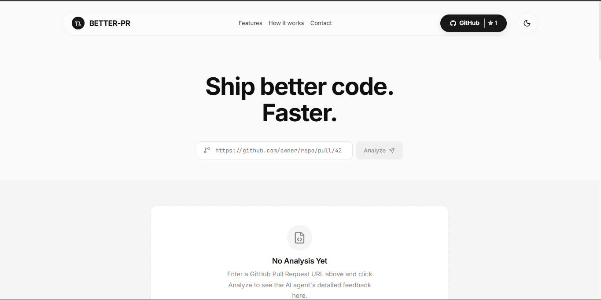

# PR Reviewer Agent



An AI-powered Pull Request and Merge Request code reviewer built with LangChain, LangGraph, and Google Gemini. 

This application acts as an automated senior software engineer, reviewing code changes, identifying security vulnerabilities, performance issues, and providing constructive feedback directly on your GitHub Pull Requests or GitLab Merge Requests.

## Features

* **Automated Code Review:** Listens for webhook events from GitHub or GitLab and automatically queues reviews for newly opened or updated pull/merge requests.
* **In-Depth Analysis:** Uses Google's Gemini LLMs (via LangChain and LangGraph) to analyze diffs and suggest improvements based on clean code principles, security best practices, and performance optimization.
* **Platform Agnostic:** Supports both GitHub and GitLab platforms natively.
* **Direct Feedback:** Automatically posts actionable, context-aware comments directly to the pull/merge request timeline.
* **Manual Trigger:** Exposes API endpoints to trigger reviews manually or get a quick analysis summary (Risk Level, Key Focus Areas, Estimated Review Time).
* **Configurable:** Restrict the agent to specific allowed repositories and easily swap out underlying LLM models.

## Architecture

The system is designed as a FastAPI web server that acts as both a webhook receiver and a standalone REST API.

1. **Webhook Layer (FastAPI):** Receives HTTP POST events from GitHub or GitLab. It verifies HMAC signatures to ensure security, validates the repository against an allowed list, and pushes the review task to a background queue.
2. **Agent Layer (LangGraph):** Uses a ReAct (Reasoning and Acting) agent architecture. The agent is provided with tools to interact with GitHub/GitLab (e.g., `get_pr_details`, `post_review`).
3. **LLM Provider:** Uses `ChatGoogleGenerativeAI` to power the reasoning engine.

## Prerequisites

* Python 3.10+
* A Google Gemini API Key (or OpenAI API key if modifying the code slightly)
* A GitHub Personal Access Token or GitLab Personal Access Token
* (Optional) `ngrok` or a similar tool to expose your local server to the internet for receiving webhooks.

## Installation

1. Clone the repository:
```bash
git clone https://github.com/yourusername/pr-reviewer-agent.git
cd pr-reviewer-agent
```

2. Create a virtual environment and activate it:
```bash
python -m venv venv
# On Windows:
venv\Scripts\activate
# On Linux/Mac:
source venv/bin/activate
```

3. Install dependencies:
```bash
pip install -r requirements.txt
```

## Configuration

Copy the provided `.env.example` file to `.env` and fill in your values.

```bash
cp .env.example .env
```

### Key Environment Variables:

* `PLATFORM`: Set to either `github` or `gitlab`.
* `GOOGLE_API_KEY`: Your Google AI Studio API key.
* `GEMINI_MODEL`: The model to use (e.g., `gemini-2.5-flash` or `gemini-2.0-flash`).
* `GITHUB_TOKEN` / `GITLAB_TOKEN`: Personal access token for the bot account that will post comments.
* `GITHUB_WEBHOOK_SECRET` / `GITLAB_WEBHOOK_SECRET`: A secret string used to verify incoming webhook payloads.
* `ALLOWED_REPOS`: A comma-separated list of repositories the bot is allowed to review (e.g., `owner/repo1,owner/repo2`). Leave blank to allow all.

## Usage

### Starting the Server

Run the FastAPI server using the provided entry point:

```bash
python -m src.main
```

The server will start on `http://0.0.0.0:8000`. 

### Setting Up Webhooks (GitHub Example)

1. Expose your local server to the internet using ngrok: `ngrok http 8000`
2. Go to your GitHub Repository -> Settings -> Webhooks -> Add webhook.
3. Payload URL: `https://<your-ngrok-url>/webhook/github`
4. Content type: `application/json`
5. Secret: The value you set for `GITHUB_WEBHOOK_SECRET` in your `.env`.
6. Select individual events: Check "Pull requests".

## API Endpoints

* `POST /webhook/github`: Receives GitHub Pull Request events.
* `POST /webhook/gitlab`: Receives GitLab Merge Request events.
* `GET /health`: Health check endpoint.
* `POST /review/{owner}/{repo}/{pr_number}`: Manually triggers a comprehensive background review for a specific PR.
* `GET /analyze/{owner}/{repo}/{pr_number}`: Returns a JSON payload containing a brief risk analysis and summary of the PR without posting a comment.

## Project Structure

```
pr-reviewer-agent/
|-- src/
|   |-- agents/
|   |   |-- pr_reviewer.py      # LangGraph ReAct agent logic
|   |-- tools/
|   |   |-- github_tools.py     # GitHub API wrappers (fetch diffs, post comments)
|   |   |-- gitlab_tools.py     # GitLab API wrappers
|   |-- utils/
|   |   |-- config.py           # Pydantic BaseSettings configuration loader
|   |-- main.py                 # FastAPI application and routing
|-- .env.example
|-- requirements.txt
```

## Deployment

This application is built with FastAPI and can be easily deployed to any platform that supports Docker or Python web applications (e.g., Render, Railway, AWS Cloud Run, Heroku).

### Using Docker (Recommended)

A `Dockerfile` is included in the root of the project. To deploy using Docker:

1. Build the image:
```bash
docker build -t pr-reviewer-agent .
```

2. Run the container (ensure you pass your environment variables):
```bash
docker run -d -p 8000:8000 --env-file .env pr-reviewer-agent
```

### Platform-Specific Deployment (Render, Railway, etc.)

1. Connect your GitHub repository to the hosting platform.
2. Set the build command: `pip install -r requirements.txt`
3. Set the start command: `uvicorn src.main:app --host 0.0.0.0 --port $PORT`
4. Copy all variables from your `.env` file into the platform's Environment Variables settings.
5. Once deployed, update your GitHub/GitLab Webhook URL to point to your new live domain (e.g., `https://your-app.onrender.com/webhook/github`).

## Contributing

Contributions are welcome. Please ensure that you follow the existing code style and include tests for any new features.

1. Fork the repository.
2. Create your feature branch (`git checkout -b feature/AmazingFeature`).
3. Commit your changes (`git commit -m 'Add some AmazingFeature'`).
4. Push to the branch (`git push origin feature/AmazingFeature`).
5. Open a Pull Request.

## License

This project is licensed under the MIT License.
